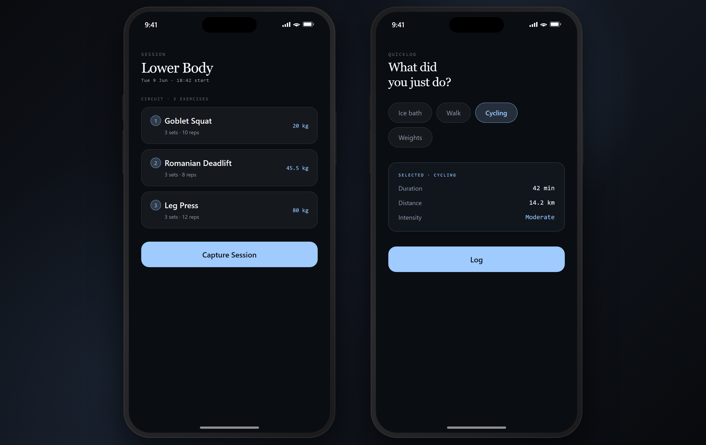
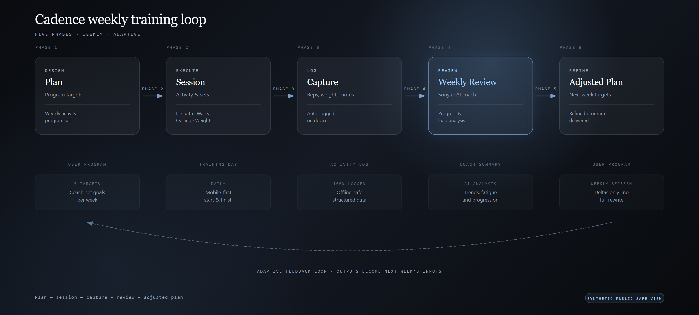

# Cadence App

A privacy-safe showcase of an AI-assisted home training app.

## Why this exists

I wanted a training system I would actually use: open the phone, see today's plan, do the session at home, log what happened, and let the next plan reflect real life.

Cadence is the app I built for that loop. It works with the Health Coach AI Agent: the agent prepares the plan, I train, Cadence captures the record, and the next plan can use that context.

This repository is a sanitized showcase. It uses synthetic examples only; it does not include private health information, real activity logs, credentials, private paths, screenshots with personal data, or production source code copied from the working app.

## Visual proof





## What is included

- A case study explaining the real problem and product choices.
- Architecture notes for the phone-first, local-first coaching loop.
- Synthetic JSON examples showing the shape of programs, logs, check-ins, and quick logs.
- One approved public-safe phone screenshot: `assets/screenshots/cadence-phone-session.png`.
- One approved public-safe loop diagram: `assets/diagrams/cadence-loop.png`.
- A sanitization checklist for keeping the public package safe.

## What Cadence tracks

Cadence is intentionally narrow. The showcase examples focus on four activity types:

- weights;
- walking;
- cycling;
- ice bath.

The goal is not to become a full fitness journal. The goal is faithful capture for the activities that feed the coaching loop.

## Repository layout

```text
.
├── README.md
├── SANITIZATION.md
├── docs/case-study.md
├── docs/architecture.md
├── examples/SCHEMA.md
├── examples/programs/              # Synthetic demo program files
├── examples/logs/                  # Synthetic demo session logs
├── examples/checkins/              # Synthetic demo readiness check-ins
├── examples/quicklogs/             # Synthetic demo quick activity logs
├── assets/screenshots/cadence-phone-session.png
└── assets/diagrams/cadence-loop.png
```

## AI-assisted builder note

I own the problem selection, workflow direction, privacy boundary, testing, and usefulness criteria. AI tools helped with implementation thinking, option generation, debugging, documentation, and iteration.

This showcase is meant to be honest about the work: practical AI-assisted building by a business practitioner, not a claim that I coded the whole system unaided.

## Privacy and local-first principles

Cadence is designed around private data. Public materials explain the pattern without exposing the real working records.

Key boundaries:

- real training logs and health context stay private;
- public examples are synthetic;
- screenshots use demo data only;
- no credentials, private paths, endpoints, account details, or personal records are included;
- cached content should be shown with clear freshness rather than failing into a blank state.

## Status

This repository is a sanitized public showcase. It explains the product pattern with synthetic examples and excludes private health context, operational records, credentials, and production source code.

## Read more

- **Medium story** — [I used AI to build a training app I would actually use](https://medium.com/@mikhail.narbekov/i-used-ai-to-build-a-training-app-i-would-actually-use-30df337b2d9d)
- **Case study** — [docs/case-study.md](docs/case-study.md)
- **Architecture notes** — [docs/architecture.md](docs/architecture.md)
- **Sanitization checklist** — [SANITIZATION.md](SANITIZATION.md)
- **More projects** — [www.mikhailnarbekov.com](https://www.mikhailnarbekov.com)
